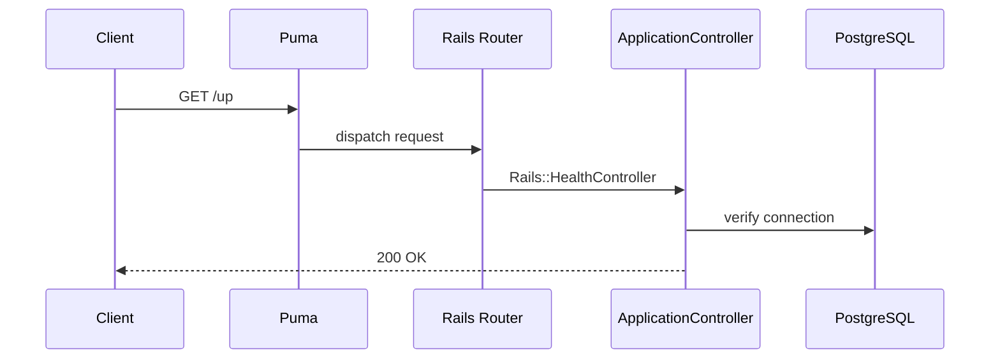
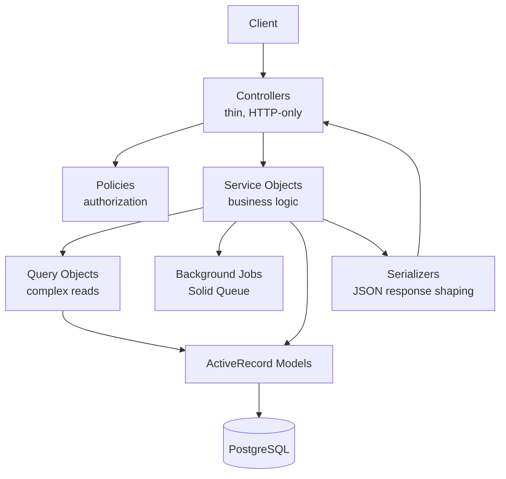

<div align="center">

# Betting Platform

**The operational core of a real-money wagering system — engineered around correctness, auditability, and concurrency-safety from the first commit.**

[](#roadmap)
[](https://github.com/jeanflaragao/backend/actions/workflows/ci.yml)
[](backend/Dockerfile)
[](backend/Gemfile.lock)
[](infra/compose/docker-compose.yml)
[](#testing-strategy)
[](#license)

</div>

---

> [!IMPORTANT]
> **Project stage.** This repository is in its **foundation phase**. The engineering scaffolding — CI/CD, containerized local development, deployment pipeline, security scanning, and dependency automation — is in place and enforced on every push. Domain logic (accounts, wagering, settlement) has not been implemented yet and is tracked explicitly in the [Roadmap](#roadmap). This README documents only what exists in the codebase today; everything else is scoped as planned work, not shipped functionality.

---

## Table of Contents

- [Project Vision](#project-vision)
- [Product Overview](#product-overview)
- [Current Features](#current-features)
- [Roadmap](#roadmap)
- [Architecture](#architecture)
- [Technology Stack](#technology-stack)
- [Project Structure](#project-structure)
- [Engineering Principles](#engineering-principles)
- [Local Development](#local-development)
- [Testing Strategy](#testing-strategy)
- [API Documentation](#api-documentation)
- [Architecture Diagrams](#architecture-diagrams)
- [Future Enhancements](#future-enhancements)
- [Contributing](#contributing)
- [About the Author](#about-the-author)
- [License](#license)

---

## Project Vision

A betting platform is not a form over a database. It is a financial system with a clock attached to it: money moves against odds that change in real time, settlement must be unambiguous even when an event's outcome is contested, and every balance change has to be reconstructable after the fact — for the user, for support, and for a regulator.

That combination of constraints is why this is not being built as a CRUD application:

- **Money correctness is non-negotiable.** Wallet balances must never be derived from application-level arithmetic alone; they need an auditable, append-only trail.
- **Concurrency is the default case, not the edge case.** Odds shift and bets are placed concurrently against the same market — the system has to reason about race conditions from the first schema decision, not retrofit locking later.
- **Settlement is irreversible.** Once a market is settled and payouts are issued, correctness has to be enforced by the data model and the process, not by careful manual review.
- **Every action needs a trail.** Support disputes, fraud review, and compliance all depend on being able to answer "what happened, and why" after the fact.

These constraints shape the architectural decisions documented below — PostgreSQL as the system of record over eventual-consistency alternatives, a layered service/policy architecture instead of business logic in controllers, and CI gates enforced from the very first commit rather than added once the codebase is "big enough to need them."

## Product Overview

The platform's target domain sits in sports and event wagering. The concepts below define the domain model the system is being designed around — implementation status for each is tracked explicitly in the [Roadmap](#roadmap), not implied here.

| Concept | Description |
|---|---|
| **Account** | A registered bettor, holding identity, authentication, and responsible-gambling limits. |
| **Wallet & Ledger** | The bettor's balance, backed by an append-only ledger of debits/credits rather than a single mutable column. |
| **Event** | A real-world occurrence (a match, a race, a fight) that can be wagered on. |
| **Market** | A specific question about an event (e.g. "who wins", "total goals over/under"). |
| **Selection / Odds** | A possible outcome within a market and its current price. |
| **Bet Slip** | One or more selections combined into a single wager with a stake. |
| **Settlement** | The process of resolving a market's outcome and applying payouts to affected ledgers. |

## Current Features

Everything listed here exists in the codebase today and is exercised by CI. Nothing in this section is aspirational.

**Infrastructure & Developer Experience**
- Reproducible local environment via Docker Compose — PostgreSQL 16 provisioned with a single command (`infra/compose/docker-compose.yml`).
- `Makefile` entry points (`up`, `down`, `logs`, `migrate`) providing a consistent developer interface across the whole system.
- Poly-repo architecture: this repository orchestrates infrastructure and owns the deployment surface, while the Rails application lives in a versioned [git submodule](https://github.com/jeanflaragao/backend) — allowing the application and its infrastructure to evolve and be reviewed independently.
- One-command environment bootstrap (`bin/setup`) and server start (`bin/dev`) in the backend application.

**Backend Application (Rails, API-only)**
- Ruby on Rails 8.0.5 configured in API-only mode (`config.api_only = true`) — no view layer, no unnecessary middleware.
- Health-check endpoint (`GET /up`) suitable for load balancer / uptime monitoring integration.
- Encrypted credentials via Rails' built-in credentials store (`config/credentials.yml.enc`), keeping secrets out of source control.
- Database-backed adapters configured for cache, background jobs, and Action Cable (Solid Cache, Solid Queue, Solid Cable) — the Rails 8 default of avoiding a Redis dependency for these concerns.

**CI/CD & Quality Gates**
- GitHub Actions pipeline running on every push and pull request against `main`, with three independent jobs:
  - **Security scanning** — [Brakeman](https://brakemanscanner.org/) static analysis for common Rails vulnerabilities.
  - **Linting** — [RuboCop](https://github.com/rails/rubocop-rails-omakase) with the Rails Omakase house style.
  - **Automated tests** — the Minitest suite, run against a real PostgreSQL service container (not mocked).
- Dependabot configured for both `bundler` and `github-actions` ecosystems, checked daily.
- Kamal deployment configuration scaffolded (`config/deploy.yml`, `.kamal/`) for containerized, zero-downtime deploys, fronted by Thruster for asset caching/compression.

## Roadmap

### Implemented
- [x] Dockerized PostgreSQL for local development
- [x] Poly-repo layout (orchestrator + `backend` submodule)
- [x] API-only Rails 8 application skeleton
- [x] Health-check endpoint
- [x] CI pipeline: security scan, lint, test
- [x] Dependency automation (Dependabot)
- [x] Deployment scaffold (Kamal + Thruster)

### In Progress
- [ ] Domain data model design (accounts, wallets, ledger, events, markets, odds, bets)

### Planned
- [ ] Authentication (`has_secure_password` or token-based, e.g. Devise/JWT)
- [ ] Authorization layer via policy objects (Pundit)
- [ ] Service objects for business use cases (bet placement, settlement)
- [ ] Query objects for complex reads (odds history, ledger reconciliation)
- [ ] JSON serialization layer (Blueprinter or `ActiveModel::Serializer`)
- [ ] Background jobs for asynchronous settlement processing (Solid Queue)
- [ ] Structured error handling and consistent API error envelope
- [ ] Test suite migration to RSpec + FactoryBot, including request specs
- [ ] Test coverage reporting (SimpleCov)
- [ ] OpenAPI / Swagger documentation

### Future Ideas
- [ ] Observability (structured logging, metrics, tracing)
- [ ] Event-driven architecture for settlement and notifications
- [ ] Feature flags for gradual rollout
- [ ] Audit logs for compliance and dispute resolution
- [ ] Multi-tenancy (multi-brand / multi-jurisdiction support)
- [ ] Production deployment to AWS
- [ ] Caching strategy for odds and market data
- [ ] Rate limiting on public API endpoints
- [ ] AI-assisted risk/trading insights
- [ ] CSV import for bulk event/market seeding

## Architecture

> The layers below describe the architectural blueprint this codebase is being built toward, derived from the API-only skeleton and configuration already in place (`config.api_only = true`, database-backed job/cache adapters, submodule separation of infra and app). Only **Controllers** and **Models** exist in skeletal form today; the rest are documented here as the intended responsibility split, tracked in the [Roadmap](#roadmap).

| Layer | Responsibility |
|---|---|
| **Controllers** | Translate HTTP into calls against services/models and models/services back into HTTP responses. No business logic — parameter handling, status codes, and delegation only. |
| **Models** | ActiveRecord persistence and data integrity (validations, associations, database constraints). No orchestration of multi-step business processes. |
| **Services** | Single-purpose objects encapsulating a business use case (e.g. `Bets::PlaceBet`, `Markets::Settle`). The place where money-moving logic actually lives. |
| **Policies** | Authorization decisions ("can this account perform this action on this resource") kept out of controllers and models. |
| **Query Objects** | Encapsulate non-trivial reads (reporting, reconciliation, filtering) that don't belong as ActiveRecord scopes. |
| **Background Jobs** | Asynchronous work — settlement processing, notifications — via Solid Queue, already configured as the default adapter. |
| **Error Handling** | A consistent API error envelope and centralized rescue handling, rather than ad hoc `rescue` blocks per controller. |
| **Authentication** | Verifying who is making the request. |
| **Authorization** | Verifying what the authenticated account is allowed to do (delegated to Policies). |
| **Testing** | Request specs verifying behavior at the HTTP boundary; service/model specs verifying business logic in isolation. |

## Technology Stack

### Backend

| Technology | Version | Purpose |
|---|---|---|
| Ruby | 3.2 (pinned in `Dockerfile`) | Language runtime |
| Ruby on Rails | 8.0.5 | API-only application framework |
| PostgreSQL | 16 | System of record — primary relational datastore |
| Puma | ≥ 5.0 | Application server |
| Solid Queue | Rails 8 default | Database-backed background job adapter |
| Solid Cache | Rails 8 default | Database-backed `Rails.cache` adapter |
| Solid Cable | Rails 8 default | Database-backed Action Cable adapter |
| Bootsnap | latest | Boot-time caching for faster startup |

### Frontend

No client application exists in this repository. The backend is deliberately API-only (`config.api_only = true`) and designed to be consumed by a decoupled client — see [Roadmap](#roadmap).

### Infrastructure

| Technology | Purpose |
|---|---|
| Docker / Docker Compose | Local PostgreSQL provisioning (`infra/compose/docker-compose.yml`) |
| Kamal | Containerized, zero-downtime deployment (`config/deploy.yml`) |
| Thruster | HTTP asset caching/compression in front of Puma |
| GitHub Actions | CI — security scan, lint, and test on every push/PR |
| Dependabot | Automated dependency updates (bundler + GitHub Actions) |

### Testing

| Tool | Role | Status |
|---|---|---|
| Minitest | Default Rails test framework | Present (scaffold, no application tests yet) |
| Brakeman | Static security analysis | Active in CI |
| RSpec + FactoryBot | Target spec-style testing stack | Planned |
| Request specs | HTTP-boundary contract testing | Planned |
| SimpleCov | Coverage reporting | Planned |

### Developer Experience

| Tool | Purpose |
|---|---|
| RuboCop (Rails Omakase) | Enforced house code style |
| Brakeman | Security static analysis, run locally via `bin/brakeman` |
| `bin/setup` | One-command environment bootstrap |
| `bin/dev` | Local server start |
| dotenv-rails | Local environment variable management |
| debug | Rails 8 default interactive debugger |

## Project Structure

```text
betting-platform/
├── Makefile                     # up / down / logs / migrate — developer entry points
├── .gitmodules                  # declares `backend` as a git submodule
├── infra/
│   └── compose/
│       └── docker-compose.yml   # local PostgreSQL 16
└── backend/                     # git submodule → github.com/jeanflaragao/backend
    ├── app/
    │   ├── controllers/         # ApplicationController (ActionController::API)
    │   ├── jobs/                # ApplicationJob (Solid Queue)
    │   ├── mailers/
    │   └── models/              # ApplicationRecord
    ├── config/
    │   ├── application.rb       # API-only mode, autoloading
    │   ├── database.yml         # PostgreSQL, env-driven credentials
    │   ├── deploy.yml           # Kamal deployment config
    │   └── routes.rb            # currently: health check only
    ├── db/                      # cache/cable/queue schemas + seeds
    ├── test/                    # Minitest scaffold
    ├── .github/
    │   ├── workflows/ci.yml     # security scan · lint · test
    │   └── dependabot.yml
    ├── Dockerfile                # production multi-stage build
    ├── Gemfile / Gemfile.lock
    └── .rubocop.yml              # Rails Omakase house style
```

**Root repository** — owns local infrastructure provisioning and the deployment surface. Kept separate from application code so infrastructure changes don't require touching (or re-reviewing) the Rails app, and vice versa.

**`backend/`** — the Rails application itself, versioned as an independent repository and pulled in as a git submodule. This allows the API to be built, tested, and deployed on its own release cadence, and keeps the door open to additional services (a future frontend, a future worker service) being added as siblings rather than nested inside the API's repo.

## Engineering Principles

- **Thin controllers.** Controllers translate HTTP; they do not contain business logic. That logic belongs in service objects.
- **Service objects for use cases.** Multi-step business processes (placing a bet, settling a market) are modeled as single-purpose, testable objects rather than spread across callbacks and controller actions.
- **Separation of concerns.** Persistence (models), authorization (policies), business logic (services), and complex reads (query objects) are deliberately kept in separate layers.
- **SOLID, applied pragmatically.** Single-responsibility objects and dependency boundaries are favored over generic, prematurely abstract frameworks-within-the-framework.
- **Convention over configuration.** Rails defaults are used unless there's a concrete reason to deviate — evidenced by the current API-only, Omakase-styled, database-backed-adapter configuration.
- **RESTful APIs.** Resources and actions are modeled around standard HTTP verbs and status codes.
- **Tests at the boundary.** Request specs are the primary tool for verifying behavior as a client of the API would experience it, complemented by focused unit specs for services and models.
- **CI as a gate, not a formality.** Security scanning, linting, and tests all run on every push — enforced from the first commit, not bolted on once the codebase "matters."
- **Maintainability and scalability by construction.** Money-adjacent systems are expensive to fix after the fact; the layering above exists to keep the codebase reasoned-about-able as it grows, not to satisfy process for its own sake.

## Local Development

### Prerequisites

- Docker and Docker Compose
- Ruby 3.2 (see `backend/Dockerfile` for the pinned version) and Bundler
- Git (with submodule support)

### Installation

```bash
# Clone with the backend submodule
git clone --recurse-submodules git@github.com:jeanflaragao/betting-platform.git
cd betting-platform

# If already cloned without submodules:
git submodule update --init --recursive
```

### Docker — start PostgreSQL

```bash
make up      # starts PostgreSQL 16 via infra/compose/docker-compose.yml
make logs    # follow container logs
make down    # stop and remove containers
```

### Backend setup

```bash
cd backend
bundle install
```

Create a `.env` file in `backend/` (loaded via `dotenv-rails`) matching the Compose credentials:

```env
DATABASE_HOST=localhost
DATABASE_PORT=5432
DATABASE_USERNAME=postgres
DATABASE_PASSWORD=postgres
DATABASE_NAME=betting_platform_development
```

### Database setup

```bash
# From the repository root — prepares both development and test databases
make migrate

# Equivalent, run directly from backend/:
bin/rails db:prepare
RAILS_ENV=test bin/rails db:prepare
```

### Running the server

```bash
cd backend
bin/dev   # starts Puma on http://localhost:3000

# Verify:
curl http://localhost:3000/up
```

### Running tests

```bash
cd backend
bin/rails test
```

### Linting & security

```bash
cd backend
bin/rubocop      # Rails Omakase style
bin/brakeman      # static security analysis
```

## Testing Strategy

The current setup uses Rails' default **Minitest** suite, exercised in CI (`bin/rails db:test:prepare test`) against a real PostgreSQL service container rather than a mocked database — a deliberate choice carried forward as the suite grows, so that CI reflects production database behavior. No application-level tests exist yet, since no application logic has been written.

**Planned testing direction** (tracked in the [Roadmap](#roadmap)):
- Migration to **RSpec** as the primary testing framework, with **FactoryBot** replacing fixtures for test data construction.
- **Request specs** as the default test type for new endpoints — verifying behavior at the HTTP boundary rather than reaching into controller internals.
- **Service specs** covering business logic in isolation from HTTP and persistence concerns.
- **SimpleCov** integrated into CI to track and enforce coverage as the domain layer is built out.
- Brakeman remains as the static security gate regardless of the spec framework used.

## API Documentation

No API documentation tooling is configured yet — the only route currently exposed is the health check (`GET /up`). Once the first domain resources exist, the plan is to adopt an OpenAPI-based toolchain (e.g. [rswag](https://github.com/rswag/rswag)) so that request specs double as the source of truth for a generated OpenAPI 3.0 spec, served via Swagger UI. This is tracked as **Planned** in the [Roadmap](#roadmap).

## Architecture Diagrams

### System Overview (current)


### Request Flow (current)



### Target Layered Architecture (planned)



## Future Enhancements

Longer-horizon ideas beyond the near-term roadmap:

- **Observability** — structured logging, metrics, and distributed tracing once the system has multiple moving parts worth correlating.
- **Event-driven architecture** — domain events for settlement and notifications, decoupling side effects from the request/response cycle.
- **Feature flags** — gradual rollout of new markets or wagering types without full deploys.
- **Audit logs** — immutable records of sensitive actions for compliance and dispute resolution, building on the ledger's append-only design.
- **Multi-tenancy** — supporting multiple brands or jurisdictions from a single codebase.
- **AWS deployment** — a production target beyond the current Kamal scaffold.
- **Caching strategy** — for high-read, low-latency data such as live odds.
- **Rate limiting** — protecting public API endpoints from abuse.
- **AI-assisted insights** — risk and trading signal support for market management.
- **CSV import** — bulk seeding of events and markets from external feeds.

## Contributing

This is currently a solo portfolio project, developed openly. The conventions below are enforced regardless of contributor count, and describe how changes are expected to land:

- **Branching** — `feature/<short-description>`, `fix/<short-description>`, `chore/<short-description>`.
- **Commits** — [Conventional Commits](https://www.conventionalcommits.org/) (`feat:`, `fix:`, `chore:`, `docs:`, `test:`), consistent with the existing history (`chore: bootstrap rails api backend`, `chore: configure postgres with docker compose`).
- **Before opening a PR** — run `bin/rubocop`, `bin/brakeman`, and `bin/rails test` locally; all three run again in CI and must pass before merge.
- **Pull requests** — scoped to a single concern, with a description of the *why*, not just the *what*.
- **Submodule changes** — if a change touches `backend/`, commit and merge there first, then bump the submodule pointer in the root repository as a separate, clearly-labeled commit.

Issues and discussion are welcome via the GitHub issue tracker on either repository.

## About the Author

**Jean Aragão** ([@jeanflaragao](https://github.com/jeanflaragao))

Backend / full-stack engineer building this project as a demonstration of production-oriented engineering practice — CI/CD discipline, layered architecture, and domain-driven design — applied to a financially sensitive domain.

- LinkedIn: `[add LinkedIn profile URL]`
- Portfolio: `[add portfolio URL]`
- Email: `[add contact email]`

## License

No license has been declared yet. A `LICENSE` file will be added prior to any public release; until then, all rights are reserved by the author.
