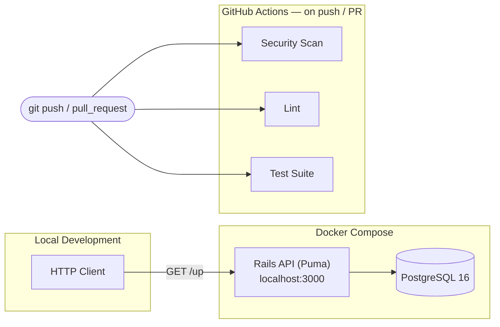

<div align="center">

# Betting Platform

**The operational and financial core for betting businesses — bookmaker accounts, bankrolls, and reconciliation, engineered around correctness, auditability, and concurrency-safety from the first commit.**

[](#roadmap)
[](https://github.com/jeanflaragao/backend/actions/workflows/ci.yml)
[](backend/Dockerfile)
[](backend/Gemfile.lock)
[](infra/compose/docker-compose.yml)
[](#license)

</div>

---

> [!IMPORTANT]
> **Project stage.** The engineering scaffolding — containerized local development, deployment pipeline, dependency automation, and a CI workflow — is in place. **CI is currently scaffolded but disabled** (see `backend/.github/workflows/ci.yml`) and needs to be re-enabled; treat "tests pass" as a local guarantee only until it is. Bookmaker account management (authentication, CRUD, authorization, filtering/search/sort, serialization, test suite) is the first implemented domain slice. The financial engine — accounts, deposits/withdrawals, bankroll, reconciliation, and reporting — has not been implemented yet and is tracked explicitly in the [Roadmap](#roadmap). This README documents only what exists today; everything else is scoped as planned work, not shipped functionality.

## Table of Contents

- [What is this project?](#what-is-this-project)
- [What problem does it solve?](#what-problem-does-it-solve)
- [Why does it exist?](#why-does-it-exist)
- [High-level architecture](#high-level-architecture)
- [Repository structure](#repository-structure)
- [Quick Start](#quick-start)
- [Documentation Index](#documentation-index)
- [Roadmap](#roadmap)
- [About](#about)
- [License](#license)

## What is this project?

A backend-first engineering effort building the operational and financial core for betting businesses: bookmaker account management, deposits and withdrawals, bankroll tracking, operational expenses, betting history, and profitability reporting. Think of it as an **ERP for betting operations** — it is not a sportsbook, not a betting website, and not a gambling product; it does not simulate odds, markets, or wagers. The full domain model is described in [docs/architecture/domain.md](docs/architecture/domain.md).

The repository is structured as a **poly-repo**: this repo owns local infrastructure and deployment; the Rails application lives in a separate, independently-versioned [`backend`](https://github.com/jeanflaragao/backend) repository, pulled in as a git submodule.

## What problem does it solve?

Anyone operating across multiple bookmakers — a professional bettor, a small trading operation, a business managing several staff accounts — ends up with money and history scattered across accounts that don't talk to each other: different currencies, different limits, different rules about what a bookmaker will let an account do after it starts winning. Answering "am I actually profitable, and where" after the fact means reconstructing that picture by hand.

These aren't edge cases in this domain — they're the normal operating conditions. This project is a single system of record for every bookmaker account an operation holds, the money moving in and out of each one, and the operational costs and outcomes needed to answer the profitability question with evidence instead of a spreadsheet guess.

## Why does it exist?

This isn't a form over a database — it's a multi-account financial ledger with reconciliation obligations attached. Money moves across many external accounts the system doesn't control, each with its own currency and rules; every deposit, withdrawal, and recorded result has to be traceable back to a specific bookmaker account and, ultimately, to a defensible profit-and-loss figure.

That's why this isn't being built as a CRUD application: money correctness across many external accounts is non-negotiable, concurrent updates to the same account or bankroll are the normal case rather than the edge case, and every balance change has to be reconstructable after the fact — for the operator, and for reconciliation. These constraints — not aesthetic preference — drive the architecture, technology choices, and CI setup. The full reasoning lives in [docs/architecture/overview.md](docs/architecture/overview.md).

## High-level architecture



An API-only Rails 8 backend, Postgres as the single system of record (also backing cache, jobs, and Action Cable via Rails 8's Solid adapters — no Redis dependency), containerized locally via Docker Compose, and deployed via Kamal. For the full system diagrams, the target layered architecture (controllers → services → policies → query objects), and the domain model, see the [Documentation Index](#documentation-index) below.

## Repository structure

```text
betting-platform/
├── README.md                 # you are here
├── Makefile                  # up / down / logs / migrate — developer entry points
├── infra/compose/            # local PostgreSQL 16 (Docker Compose)
├── backend/                  # git submodule → github.com/jeanflaragao/backend (Rails API)
│   └── README.md             # backend implementation guide
├── frontend/                 # not yet implemented
│   └── README.md
└── docs/
    ├── architecture/         # system, backend, and domain design docs
    ├── adr/                  # architecture decision records
    ├── api/                  # API documentation strategy
    └── development/          # local setup and contribution workflow
```

**Root repository** — owns local infrastructure provisioning and the deployment surface. Kept separate from application code so infrastructure changes don't require touching (or re-reviewing) the Rails app, and vice versa.

**`backend/`** — the Rails application, versioned as an independent repository and pulled in as a git submodule, so the API can be built, tested, and deployed on its own release cadence. See [why](docs/architecture/overview.md#poly-repo-model).

## Quick Start

```bash
# Clone with the backend submodule
git clone --recurse-submodules git@github.com:jeanflaragao/betting-platform.git
cd betting-platform

# Start PostgreSQL
make up

# Backend setup (needs a .env — see docs/development)
cd backend
bundle install
bin/setup

# Verify
curl http://localhost:3000/up
```

Full setup instructions (environment variables, database prep, running tests) live in [docs/development](docs/development/README.md).

## Documentation Index

| Document | Purpose |
|----------|---------|
| [backend/README.md](backend/README.md) | Backend architecture and implementation — practical guide for engineers working in the Rails app |
| [frontend/README.md](frontend/README.md) | Frontend status and planned direction |
| [docs/architecture/overview.md](docs/architecture/overview.md) | System-level architecture, poly-repo rationale, diagrams |
| [docs/architecture/backend.md](docs/architecture/backend.md) | Backend layering, target architecture, design philosophy |
| [docs/architecture/domain.md](docs/architecture/domain.md) | Domain model (bookmakers, accounts, ledger, reconciliation) |
| [docs/adr/README.md](docs/adr/README.md) | Architecture Decision Records |
| [docs/api/README.md](docs/api/README.md) | API documentation strategy |
| [docs/development/README.md](docs/development/README.md) | Local setup and contribution workflow |

## Roadmap

Organized by engineering milestone rather than a flat feature list, so the path from today's scaffold to a functioning platform is legible at a glance.

### Foundation
- [x] Dockerized PostgreSQL for local development
- [x] Poly-repo layout (orchestrator + `backend` submodule)
- [x] API-only Rails 8 application skeleton
- [x] Health-check endpoint
- [ ] CI pipeline enforced on every push — workflow is scaffolded (security scan, lint, test) but currently disabled; needs re-enabling
- [x] Dependency automation (Dependabot)
- [x] Deployment scaffold (Kamal + Thruster)

### Core Domain — Bookmaker Account Management
- [x] Authentication (`has_secure_password` + JWT)
- [x] Bookmaker management (create, list, show — owned per user)
- [x] Authorization layer via policy objects (Pundit)
- [x] Query objects for filtering, search, sort, and pagination
- [x] JSON serialization layer (Alba)
- [x] Test suite (RSpec + FactoryBot), including request specs
- [ ] Structured, consistent API error envelope — in progress
- [ ] Bookmaker deletion with business-rule guards (e.g. block deletion while linked accounts are active) — in progress
- [ ] OpenAPI / Swagger documentation

### Financial Engine
- [ ] Account model (an account held at a given bookmaker, scoped to a bookmaker)
- [ ] Deposit / withdrawal ledger (append-only) per account
- [ ] Bankroll aggregation across accounts
- [ ] Operational expense tracking
- [ ] Bet-history recording, for profitability analysis (not for placing bets)
- [ ] Account limitation tracking (bookmaker-imposed restrictions)
- [ ] Reconciliation and profitability reporting

### Product Intelligence
- [ ] CSV import for bulk transaction / bet-history import
- [ ] AI-assisted profitability and risk insights

### Scalability
- [ ] Caching strategy for account and bankroll read models
- [ ] Rate limiting on public API endpoints
- [ ] Multi-tenancy (multi-brand / multi-jurisdiction support)

### Observability
- [ ] Structured logging, metrics, and distributed tracing
- [ ] Test coverage reporting (SimpleCov)

### Cloud
- [ ] Production deployment to AWS

### Future Enhancements

Ideas beyond the scoped roadmap above — directionally likely, not yet committed to:

- Seed data and demo fixtures for a realistic local environment without production data.
- Feature flags for gradual rollout of new bookmaker integrations or reporting features without full deploys.
- Audit logs as an immutable, queryable trail for compliance and dispute resolution — distinct from the ledger's transactional record.
- Multi-region / high-availability deployment topology, once a single Kamal target stops being sufficient.
- Event-driven architecture for transaction processing and notifications, decoupling side effects from the request/response cycle.

## About

**Jean Aragão** ([@jeanflaragao](https://github.com/jeanflaragao))

This project is an ongoing engineering effort in software architecture and backend engineering, built around a financially sensitive domain — chosen deliberately because correctness and concurrency can't be faked with a CRUD scaffold. The engineering practices documented throughout this repository (CI from the first commit, layered architecture, documented decisions) are as much the point of this project as the eventual feature set.

- LinkedIn: `https://www.linkedin.com/in/aragao-jean/`

Contributions, issues, and discussion are welcome — see [docs/development](docs/development/README.md#contributing) for conventions.

## License

No license has been declared yet. A `LICENSE` file will be added prior to any public release; until then, all rights are reserved by the author.
