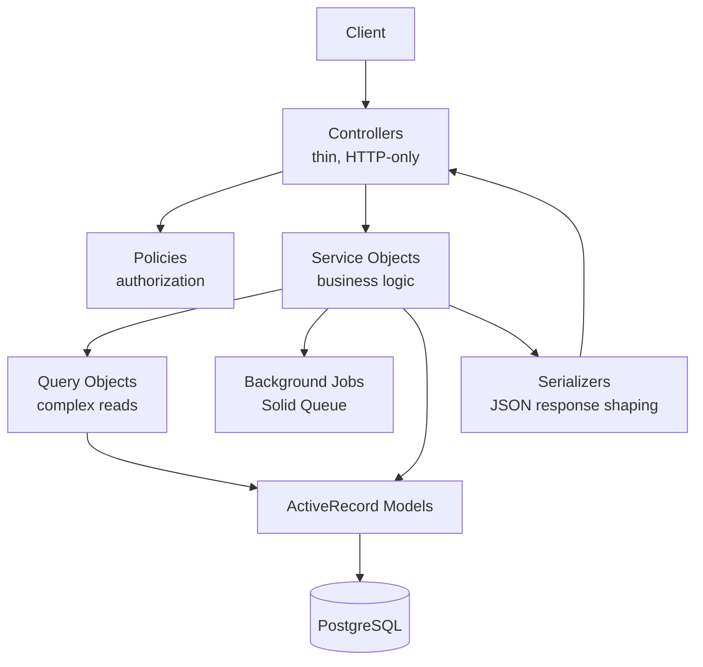

# Backend Architecture

> Conceptual design of the backend subsystem — the target layering and the reasoning behind it. For practical setup, folder structure, and current implementation status, see [backend/README.md](../../backend/README.md). For system-level context, see [overview.md](overview.md).

## Layer Responsibility Matrix

> The table below defines architectural responsibilities, not implementation status. It describes the blueprint this codebase is being built toward, derived from the API-only skeleton and configuration already in place (`config.api_only = true`, database-backed job/cache adapters, submodule separation of infra and app). Only **Controllers** and **Models** exist in skeletal form today; the rest are tracked in the [Roadmap](../../README.md#roadmap).

| Layer | Responsibility |
|---|---|
| **Controllers** | Translate HTTP into calls against services/models and models/services back into HTTP responses. No business logic — parameter handling, status codes, and delegation only. |
| **Models** | ActiveRecord persistence and data integrity (validations, associations, database constraints). No orchestration of multi-step business processes. |
| **Services** | Single-purpose objects encapsulating a business use case (e.g. `Bookmakers::CreateService`, `Accounts::RecordDeposit`). The place where money-moving logic actually lives. |
| **Policies** | Authorization decisions ("can this account perform this action on this resource") kept out of controllers and models. |
| **Query Objects** | Encapsulate non-trivial reads (reporting, reconciliation, filtering) that don't belong as ActiveRecord scopes. |
| **Background Jobs** | Asynchronous work — reconciliation runs, report generation, notifications — via Solid Queue, already configured as the default adapter. |
| **Error Handling** | A consistent API error envelope and centralized rescue handling, rather than ad hoc `rescue` blocks per controller. |
| **Authentication** | Verifying who is making the request. |
| **Authorization** | Verifying what the authenticated account is allowed to do (delegated to Policies). |
| **Testing** | Request specs verifying behavior at the HTTP boundary; service/model specs verifying business logic in isolation. |

## Target Layered Architecture

## Architecture Philosophy

The layering above isn't a Rails convention followed out of habit — each boundary exists to contain a specific way this domain can go wrong.

**Business rules live in services** because an operation like recording a deposit touches multiple records — account, transaction, bankroll projection — that must succeed or fail together. Putting that logic in a controller action or a model callback makes the failure mode implicit; a service object makes it a single, testable unit.

**Controllers coordinate, they don't decide.** Their only job is turning a request into a service call and a result into an HTTP response. Understanding how a deposit gets recorded shouldn't require reading a controller.

**Policies authorize** because who-can-do-what changes independently of both the request shape and the persistence model. Coupling authorization to either makes both harder to change safely later.

**Models protect data integrity** at the layer closest to the database — validations and constraints — not business process. A model that also orchestrates a multi-step transaction is doing two jobs.

**Queries optimize reads** because a reconciliation report and a single record lookup are different problems. Conflating them tends to pull ActiveRecord scopes in directions that hurt both.

## Why these decisions, specifically

Architectural choices in this codebase are meant to be discoverable, not just inferable from the code. As services, query objects, error handling, authorization, and the testing strategy are implemented, the reasoning behind each decision — not just the resulting code — is recorded as lightweight Architecture Decision Records under [`docs/adr/`](../adr/README.md).

The goal is that a reviewer can find out *why* a decision was made — for example, why reconciliation runs as a background job instead of inline, or why authorization is a separate policy layer instead of model scopes — without reconstructing it from commit history.
