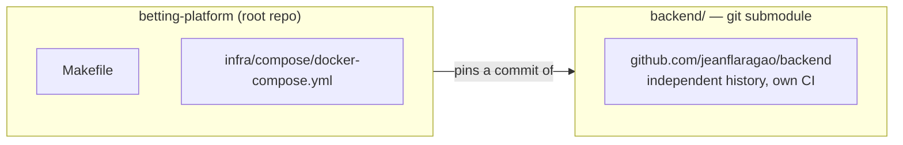
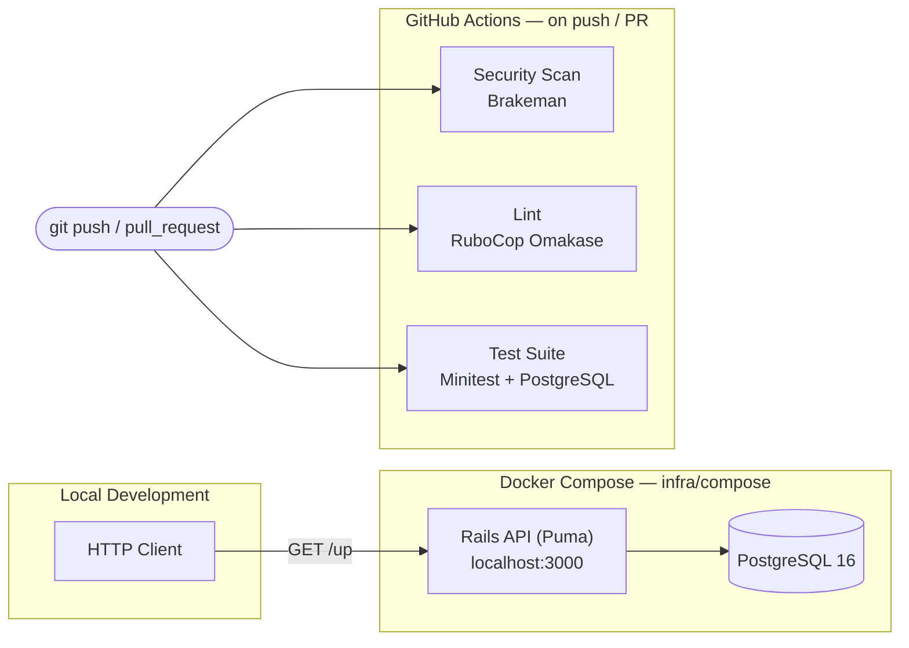
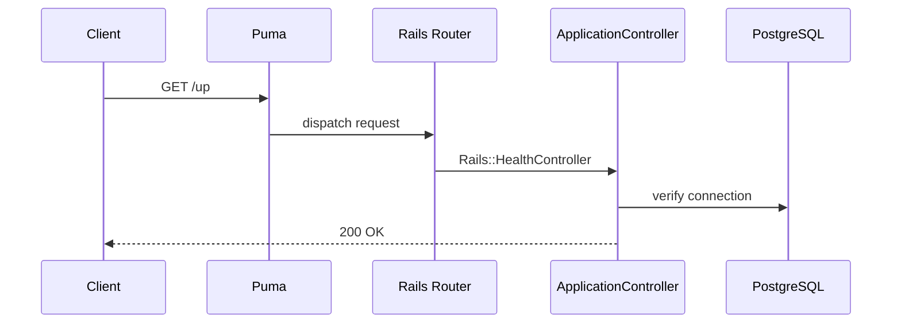

# System Architecture — Overview

> System-level documentation. For backend implementation details, see [backend.md](backend.md). For the domain model, see [domain.md](domain.md). For the frontend, see [../../frontend/README.md](../../frontend/README.md) (not yet implemented).

## Poly-repo model

This project is deliberately **not** a monorepo. The root repository (`betting-platform`) and the Rails application (`backend/`) are separate Git repositories, joined via a git submodule:

**Why not a monorepo:**

- **Independent release cadence.** The Rails API can be built, tested, and deployed on its own schedule, with its own CI, without the root repo's infrastructure changes forcing a review of application code (or vice versa).
- **Room for siblings.** A future frontend or worker service can be added as a sibling submodule rather than nested inside the API's repo.
- **Clean ownership boundary.** The root repo owns *how the system is provisioned and deployed*; `backend/` owns *what the system does*.

The trade-off is coordination overhead: a change spanning both repos requires two commits (backend first, then the submodule pointer bump in root) — see [docs/development](../development/README.md#submodule-workflow) for the exact workflow.

## Why not a CRUD application

A betting platform is a financial system with a clock attached to it: money moves against odds that change in real time, settlement must be unambiguous even when an outcome is contested, and every balance change has to be reconstructable after the fact — for the user, for support, and for a regulator. That combination of constraints shapes every architectural decision here:

- **Money correctness is non-negotiable.** Wallet balances must never be derived from application-level arithmetic alone; they need an auditable, append-only trail.
- **Concurrency is the default case, not the edge case.** Odds shift and bets are placed concurrently against the same market — the system has to reason about race conditions from the first schema decision, not retrofit locking later.
- **Settlement is irreversible.** Once a market is settled and payouts are issued, correctness has to be enforced by the data model and the process, not by careful manual review.
- **Every action needs a trail.** Support disputes, fraud review, and compliance all depend on being able to answer "what happened, and why" after the fact.

These constraints — not aesthetic preference — are what the layering described in [backend.md](backend.md), the technology choices, and the CI setup are built to satisfy.

## System overview (current)

## Request flow (current)

Once domain resources exist, this diagram will grow to include the layered flow documented in [backend.md](backend.md#target-layered-architecture).

## Related documents

| Document | Covers |
|---|---|
| [backend.md](backend.md) | Backend layering, target architecture, architecture philosophy |
| [domain.md](domain.md) | Domain concepts (accounts, markets, odds, settlement) |
| [../adr/README.md](../adr/README.md) | Architecture Decision Records |
| [../api/README.md](../api/README.md) | API documentation strategy |
| [../development/README.md](../development/README.md) | Local setup and contribution workflow |
| [../../backend/README.md](../../backend/README.md) | Backend implementation guide (practical, for engineers working in the repo) |
